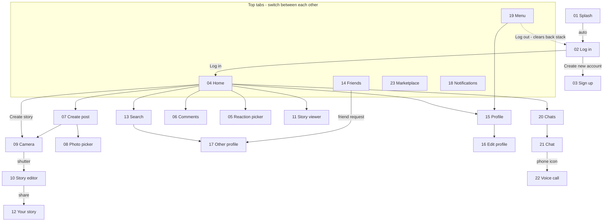

# Kinnect — Roadmap

**Progress:** 23 of 23 screens done · Phases 0–7 and 9 complete 

## Navigation Flow

- **Splash** opens **Log in** automatically.
- **Log in** leads to **Home**; "Create new account" leads to **Sign up**.
- The five top tabs (**Home**, **Friends**, **Marketplace**, **Notifications**, **Menu**) switch between the main screens.
- **Home** links to **Search**, **Chats**, **Create post**, **Comments**, the **Reaction picker**, a **Story viewer**, your **Profile** and, through "Create story", the **Camera**.
- **Create post** opens the **Photo picker** and the **Camera**.
- The **Camera** shutter opens the **Story editor**, which shares to **Your story**.
- **Search** and friend requests (on **Friends**) open **Other profile**.
- **Profile** opens **Edit profile**.
- **Chats** opens a **Chat**, and the phone icon in a Chat opens the **Voice call**.
- **Menu** opens **Profile** and logs out to **Log in**.
- **Back** always returns to the previous screen, and **Log out** clears the back stack.

## Flowchart

## Build Order

### Phase 0 · Foundation
- [x] Colours (`colors.xml`, primary teal `#0B5F63`)
- [x] Theme without action bar
- [x] Shape drawables (buttons, input boxes, circle avatars, pills)
- [x] Icons (Vector Assets)
- [x] Logo and placeholder images

### Phase 1 · Auth
- [x] 01 Splash
- [x] 02 Log in
- [x] 03 Sign up

### Phase 2 · Top Tabs
- [x] Top tab bar
- [x] 04 Home feed
- [x] 14 Friends
- [x] 23 Marketplace
- [x] 18 Notifications
- [x] 19 Menu

### Phase 3 · Opened from Home
- [x] 06 Comments
- [x] 05 Reaction picker
- [x] 11 Story viewer
- [x] 13 Search

### Phase 4 · Profiles
- [x] 15 Profile
- [x] 16 Edit profile
- [x] 17 Other profile

### Phase 5 · Create
- [x] 07 Create post
- [x] 08 Photo picker
- [x] 09 Camera
- [x] 10 Story editor
- [x] 12 Your story

### Phase 6 · Messaging
- [x] 20 Chats
- [x] 21 Chat
- [x] 22 Voice call

### Phase 7 · Polish
- [x] Back stack and Log out
- [x] Landscape and tablet check
- [x] Code comments

### Phase 8 · Tests
- [ ] Espresso test 1
- [ ] Espresso test 2 (multistep path)

### Phase 9 · Submission
- [ ] Zip: full source code + XML/Kotlin-only folder