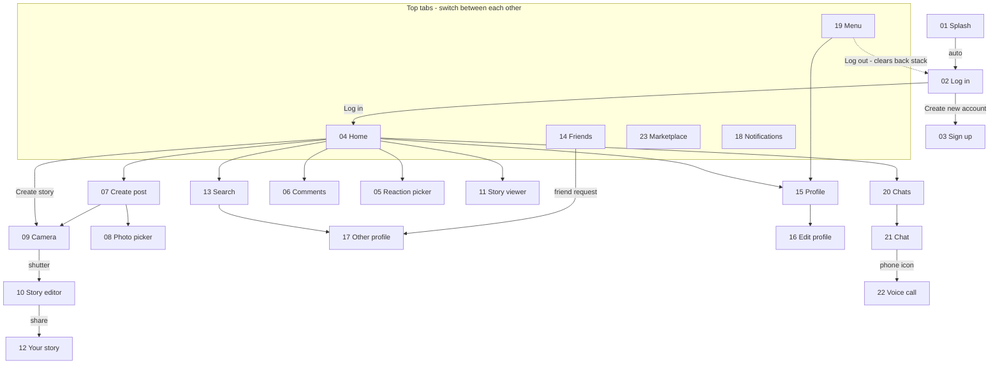

# Kinnect — Roadmap

## Navigation Flow

- **Splash** opens **Log in** automatically.
- **Log in** leads to **Home**; "Create new account" leads to **Sign up**.
- The five top tabs (**Home**, **Friends**, **Marketplace**, **Notifications**, **Menu**) switch between the main screens.
- **Home** links to **Search**, **Chats**, **Create post**, **Comments**, the **Reaction picker**, a **Story viewer**, your **Profile** and, through "Create story", the **Camera**.
- **Create post** opens the **Photo picker** and the **Camera**.
- The **Camera** shutter opens the **Story editor**, which shares to **Your story**.
- **Search** and friend requests (on **Friends**) open **Other profile**.
- **Profile** opens **Edit profile**.
- **Chats** opens a **Chat**, and the phone icon in a Chat opens the **Voice call**.
- **Menu** opens **Profile** and logs out to **Log in**.
- **Back** always returns to the previous screen, and **Log out** clears the back stack.

## Flowchart

## Build Order

### Phase 0 · Foundation
- [ ] Colours (`colors.xml`, primary teal `#0B5F63`)
- [ ] Theme without action bar
- [ ] Shape drawables (buttons, input boxes, circle avatars, pills)
- [ ] Icons (Vector Assets)
- [ ] Logo and placeholder images

### Phase 1 · Auth
- [ ] 01 Splash
- [ ] 02 Log in
- [ ] 03 Sign up

### Phase 2 · Top Tabs
- [ ] Top tab bar
- [ ] 04 Home feed
- [ ] 14 Friends
- [ ] 23 Marketplace
- [ ] 18 Notifications
- [ ] 19 Menu

### Phase 3 · Opened from Home
- [ ] 06 Comments
- [ ] 05 Reaction picker
- [ ] 11 Story viewer
- [ ] 13 Search

### Phase 4 · Profiles
- [ ] 15 Profile
- [ ] 16 Edit profile
- [ ] 17 Other profile

### Phase 5 · Create
- [ ] 07 Create post
- [ ] 08 Photo picker
- [ ] 09 Camera
- [ ] 10 Story editor
- [ ] 12 Your story

### Phase 6 · Messaging
- [ ] 20 Chats
- [ ] 21 Chat
- [ ] 22 Voice call

### Phase 7 · Polish
- [ ] Back stack and Log out
- [ ] Landscape and tablet check
- [ ] Code comments

### Phase 8 · Tests
- [ ] Espresso test 1
- [ ] Espresso test 2 (multi-step path)

### Phase 9 · Submission
- [ ] Zip: full source code + XML/Kotlin-only folder
